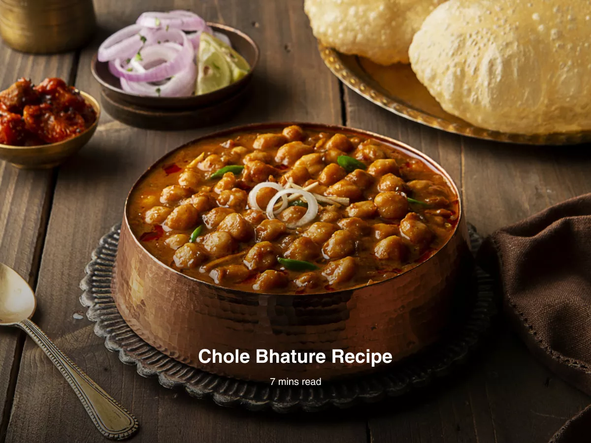

# Odin Recipes



A small collection of simple Indian recipes built as static HTML pages. Clean, easy to navigate, and perfect for practicing basic web layout and file organization.

## Pages
- Home: `index.html`
- Recipes:
  - `recipes/shahi-paneer.html`
  - `recipes/Chole-Bhature.html`
  - `recipes/chilli-cheese-maggie.html`

## Features
- Minimal, responsive HTML structure
- Local image assets for each recipe
- Easy to extend — add new recipe HTML files in the `recipes/` folder and reference images from `images/`

## Quick start
1.  Open the project folder in your file explorer (like Windows File Explorer, macOS Finder, or Linux's Nautilus/Dolphin).
2.  To preview the site, simply **double-click the `index.html` file**. It will open in your default web browser.
3.  Alternatively, you can open it from your terminal:
    * **macOS:**
        ```bash
        open index.html
        ```
    * **Linux:**
        ```bash
        xdg-open index.html
        ```
    * **Windows (Command Prompt):**
        ```bash
        start index.html
        ```
    * **Windows (PowerShell):**
        ```bash
        Invoke-Item index.html
        ```
4.  You can also open `index.html` from your editor (VS Code) and use an extension like "Open in Default Browser".

## 📁 Project structure
```
odin-recipes/
├── index.html
├── README.md
├── images/
│   └── Chole-Bhature-1.jpg
└── recipes/
    ├── Chole-Bhature.html
    ├── shahi-paneer.html
    └── chilli-cheese-maggie.html
```
